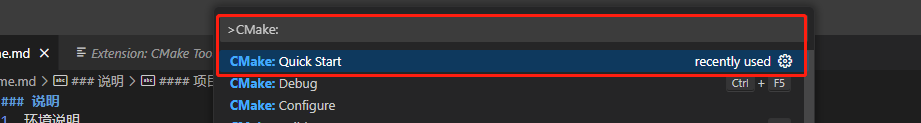
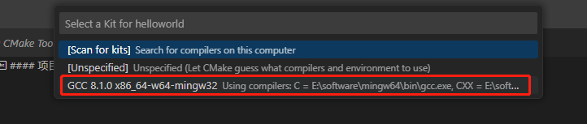
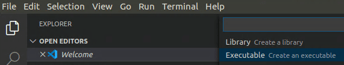
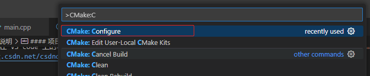
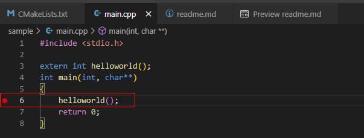
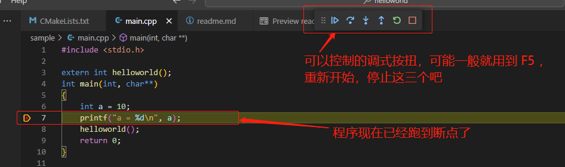
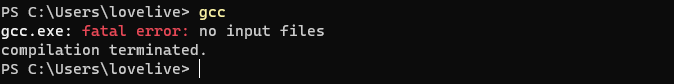
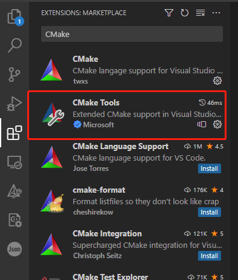
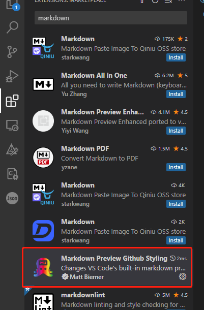

### 说明
1. 项目实例
2. 环境说明

#### 参考

1. [CMake Tools on linux](https://code.visualstudio.com/docs/cpp/CMake-linux)
    
2. [CMake 项目创建](https://github.com/microsoft/vscode-cmake-tools/blob/main/docs/how-to.md#create-a-new-project)

其实主要是配要在 VS code 上的可视化界面，如何只用命令行的话，只用 CMake 那么和在 linux 上是差不多的。如出现 ```namke -? failed with ``` 则需要加上```-G"MinGw Makefiles"```, **[参考](https://blog.csdn.net/csdndulala/article/details/121390778)**

```
cmake -G"MinGW Makefiles" ..
```

#### 项目实例

如果是第一次配置，需要配置 1~3 步。1~3 步是按着 [CMake Tools on linux][cmakeqs] 官方步骤走的。

1. 按 `Ctrl+Shift+P` 选择 `CMake:Quick Start` 

    

2. 选择编译器

    

3. 如果有让选 Executable 或是 library 选 Executable 。

    

4. 配置完环境后在 VS code 的最下边会有显示
    

5. 如果是现有的项目，使用 VS code 打开后，按 `Ctrl+Shift+P` 选择 `CMake:Configure` ,CMake 重新生成配置。
    

6. 调试可在代码行前加断点，按 `Ctrl+Shift+P` 选择 `CMake:Debug` 
    
    
    程序运行至断点
    


#### 环境说明
1. VS code  
2. [minGW 64 ](https://github.com/niXman/mingw-builds-binaries/releases/download/12.2.0-rt_v10-rev0/x86_64-12.2.0-release-posix-seh-rt_v10-rev0.7z)

    如何已安装可跳过

    下载完成后解压，将其目录下的 bin 路径加入到系统的 path 环境变量中。
    
    

    在 cmd 窗口中使用 gcc 命令，如输出正常则说明安装成功。

    


3. [CMake](https://cmake.org/download/)
    CMake 可下载 .msi 与 .zip 安装的，两者的区别不大。.msi 安装时可以在界面选择添加路径到系统变量。如是 .zip 则需要把其目录下的 bin 路径手动添加到系统变量。

4. VS code 中 CMake tools 安装

    
    
5. 本 md 可以安装 VS code 插件，在 VS code 中预览

    


[mingw]:[https://github.com/niXman/mingw-builds-binaries/releases/download/12.2.0-rt_v10-rev0/x86_64-12.2.0-release-posix-seh-rt_v10-rev0.7z]
[cmake]:[https://cmake.org/download/]
[cmakeqs]:[https://code.visualstudio.com/docs/cpp/CMake-linux]
[cmakecanp]:[https://github.com/microsoft/vscode-cmake-tools/blob/main/docs/how-to.md#create-a-new-project]
